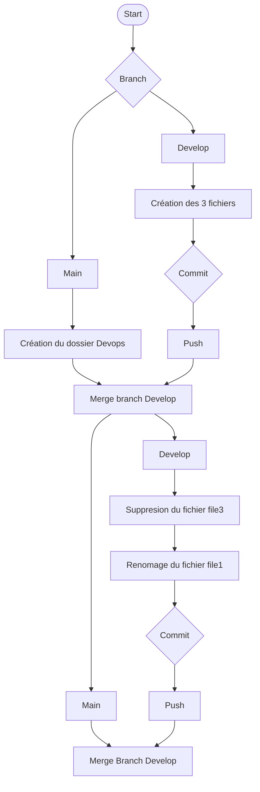

# TP-Git
## Commandes:
### SSH:
```
ssh-keygen -t ed25519 -C "dylanmorel0117@gmaiL.com"
```
### Dossier Devops
Création du dossier DevOps via interface graphique de visual studio code

### Création de la branche develop
```
git branch develop
```
### Push des fichiers sur Github
```
git add Devops/*
git commit -m "depot"
git push origin develop
```

### Merge de la branche develop sur la branch main
```
git switch main
git merge develop
```

### Renomage du fichier file1 et supression du fichier file3
```
git mv ./DevOps/file1 ./DevOps/file1.txt
git rm DevOps/file3
git commit -m "depot"
git push origin develop
```

### Merge de la branche develop sur la branch main
```
git switch main
git merge develop
```

## Liens Utilisés:
```
https://training.github.com/downloads/fr/github-git-cheat-sheet.pdf
https://www.atlassian.com/fr/git/glossary#commands
https://www.hostinger.com/fr/tutoriels/commandes-git
https://git-scm.com/book/en/v2/Git-Branching-Basic-Branching-and-Merging
```
## Diagram du flow




